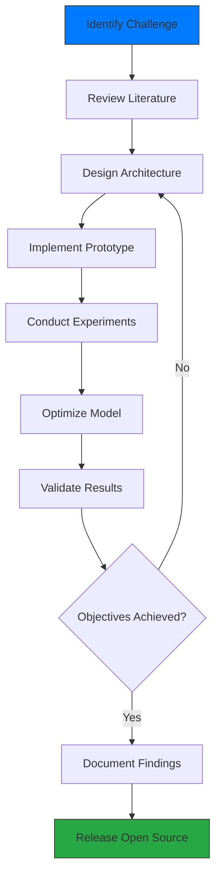

<div align="center">

# Muhammad Huzaifa


[](https://github.com/Muhammad-Huzifa)
[](https://github.com/Muhammad-Huzifa)
[](https://www.linkedin.com/in/muhammad-huzifa3202/)
[](mailto:mhuzaifa3202@gmail.com)

</div>

---

## 👤 About Me

I am a dedicated Deep Learning Researcher and AI Engineer holding a Bachelor's degree in Computer Science from Islamia College University, Peshawar (2021–2025). My expertise lies in crafting innovative neural architectures that optimize performance while ensuring efficiency for practical, real-world applications.

**Research Philosophy:** *Advancing AI by creating models that are precise, resource-efficient, and readily deployable across diverse environments.*

### 🔍 Research Interests
- Neural architecture innovation for computer vision and temporal data processing
- Efficient deep learning for edge and real-time systems
- Spatio-temporal modeling via graph neural networks, transformers, and hybrids
- Multimodal data fusion and integration strategies
- Optimization techniques for model compression and deployment

### 🛠 Core Expertise
```python
expertise = {
    "Deep Learning": [
        "Graph Neural Networks (GNNs)",
        "Transformer Models",
        "Recurrent Networks (RNNs, LSTMs, GRUs)",
        "Convolutional Networks (CNNs)",
        "Attention Mechanisms"
    ],
    "Computer Vision": [
        "Pose Estimation and Landmark Detection",
        "Action Recognition and Classification",
        "Object Detection and Segmentation",
        "Video Analysis and Temporal Modeling"
    ],
    "Optimization": [
        "Efficient Architectures",
        "Knowledge Distillation and Pruning",
        "Quantization and Compression",
        "Real-Time Inference"
    ],
    "Engineering": [
        "Full Pipeline Development",
        "Experiment Tracking and Reproducibility",
        "Scalable Implementation",
        "Deployment Strategies"
    ]
}
```

---

## 🚀 Research and Projects

<div align="center">
### 🌟 **Key Contributions**
*Innovating AI solutions with a focus on efficiency, scalability, and impact*
</div>

### 📈 Current Focus
My research emphasizes advanced architectures for handling spatio-temporal data, including:
- Graph-based approaches for relational modeling
- Transformer hybrids for sequence analysis
- Lightweight models for constrained resources
- Fusion methods for multi-modal inputs

### 🔑 Highlighted Projects
<table>
<tr>
<td width="50%">
#### 🧠 Neural Architecture Innovation
Designing cutting-edge models that balance complexity and efficiency:
- Spatio-temporal graph networks with adaptive mechanisms
- Hybrid transformer-CNN architectures
- Parameter-efficient designs for high performance
**Innovations:**
- Dynamic graph learning
- Multi-scale temporal processing
- Cross-modal integration
- Advanced training protocols
</td>
<td width="50%">
#### 🎯 Vision and AI Systems
Building robust computer vision pipelines:
- Real-time pose and action systems
- Sequential modeling frameworks
- Multi-stream data processing
**Highlights:**
- Low-latency inference
- Sophisticated augmentation
- Optimized training schedules
- Deployment-ready solutions
</td>
</tr>
</table>

### 📊 Impact Metrics
<div align="center">
| Area | Metrics | Outcomes |
|------|---------|----------|
| **Efficiency** | Parameter Count | Models under 1M parameters with top-tier accuracy |
| **Performance** | Inference Time | Sub-20ms latency on standard hardware |
| **Accuracy** | Benchmarks | Competitive results on industry standards |
| **Scalability** | Deployment | Edge-compatible implementations |
</div>

---

## 🧰 Technical Proficiency

<div align="center">

### **AI and Machine Learning**


### **Vision and Data Tools**


### **Development Essentials**


### **Visualization**


</div>

---

## 📊 GitHub Insights

<div align="center">


[](https://git.io/streak-stats)


</div>

---

## 🔄 Research Methodology

<div align="center">

</div>

### **Approach to Research:**
1. **Challenge-Driven:** Address practical problems beyond benchmarks
2. **Efficiency-Centric:** Integrate optimization early in design
3. **Reproducible:** Maintain detailed code and documentation
4. **Iterative:** Refine through rigorous testing
5. **Applied:** Ensure seamless transition to production

---

## 🌟 Achievements

<div align="center">

| Achievement | Details |
|-------------|---------|
| 🏆 **Model Innovation** | Created efficient architectures rivaling SOTA |
| ⚡ **Performance Optimization** | Achieved real-time capabilities with minimal resources |
| 📚 **Open Source Impact** | Contributed well-documented repositories |
| 🔬 **Technique Advancement** | Pioneered in GNNs, transformers, and attention |
| 🎯 **Comprehensive Solutions** | Delivered full-stack AI pipelines |

</div>

---

## 📂 Key Repositories

<div align="center">
Discover my open-source work, featuring:
- Clean, modular codebases
- Thorough documentation
- Complete training setups
- Pre-trained models
- Experimental reproducibility
</div>

### **Focus Areas:**
- 🧠 AI Architecture Development
- 📊 ML Fundamentals
- 🎥 Vision Applications
- 🔧 Research Tools

---

## 🤝 Collaboration and Open Source

Committed to open-source excellence, I develop resources that are educational, reproducible, and adaptable. 

**Open For:**
- Research partnerships in neural design
- Efficiency projects for edge AI
- Vision and video AI initiatives
- Optimization and deployment consulting
- Reimplementations of cutting-edge papers

---

## 📬 Get in Touch

<div align="center">

[](https://www.linkedin.com/in/muhammad-huzifa3202/)
[](mailto:mhuzaifa3202@gmail.com)
[](https://www.kaggle.com/muhammadhuzaifa)
[](https://github.com/Muhammad-Huzifa)

**📧 Email:** mhuzaifa3202@gmail.com  
**💼 LinkedIn:** [muhammad-huzifa3202](https://www.linkedin.com/in/muhammad-huzifa3202/)  
**📍 Location:** Peshawar, Pakistan

</div>

---

<div align="center">

### 💡 *"Pioneering efficient AI for real-world impact"*

**Mission:** Translating advanced research into accessible, deployable AI technologies.

---

### 🌟 Contributions
✅ **Diverse Projects:** Spanning AI domains  
✅ **Efficiency Expertise:** Lightweight model specialization  
✅ **Community Engagement:** Open-source advocacy  
✅ **Professional Code:** Industry-grade standards  
✅ **Ongoing Innovation:** Exploring new frontiers

---

**⭐ Star repositories if valuable! Open to collaborations and AI discussions. ⭐**

</div>

---

<div align="center">
  
</div>
