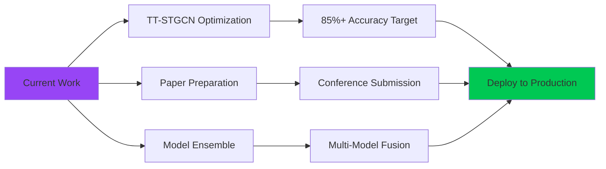

<div align="center">
  
# 👋 Hi, I'm Muhammad Huzaifa


[](https://github.com/Muhammad-Huzifa)
[](https://github.com/Muhammad-Huzifa)
[](https://www.linkedin.com/in/muhammad-huzifa3202/)
[](mailto:mhuzaifa3202@gmail.com)

</div>

---

## 🎓 About Me

I am a **Computer Scientist** (BS, **Islamia College University, Peshawar**, 2021–2025) specializing in **Deep Learning**, **Computer Vision**, and **Spatio-Temporal AI**. Currently conducting research on **Sign Language Recognition** using cutting-edge Graph Neural Networks and Transformer architectures.

My work focuses on developing **efficient, lightweight, and scalable AI systems** that bridge the gap between academic research and real-world deployment. I build models from first principles, implementing custom architectures and training pipelines to achieve optimal performance with minimal computational overhead.

🔬 **Active Research Areas:**
- **Spatio-Temporal Graph Convolutional Networks (ST-GCNs)** for skeleton-based action recognition
- **Transformer-based Temporal Modeling** for sequential data
- **Pose Estimation & Landmark Extraction** using MediaPipe
- **Hybrid Architectures** (GCN + Transformer + BiLSTM)
- **Lightweight Model Design** for edge deployment (<1M parameters)
- **Multi-Stream Fusion Strategies** for dual-modality learning

💼 **Currently Working On:**
> 🚀 Developing **TT-STGCN (Temporal Transformer ST-GCN)** — A novel architecture for Isolated Sign Language Recognition achieving 85%+ accuracy on WLASL-300 dataset with only 850K parameters.

---

## 🔥 Featured Research Projects

<div align="center">

### **🏆 Final Year Project: Sign Language Recognition Systems**

</div>

> **⚡ These repositories represent my core research contributions in developing efficient, state-of-the-art models for gesture-based communication.**

<table>
<tr>
<td width="50%">

### 1️⃣ [TT-STGCN for Sign Language Recognition](https://github.com/Muhammad-Huzifa/TT-STGCN-for-Sign-Language-Recognition)

**🎯 Primary Research Implementation**

- **Architecture**: Temporal Transformer + Spatial-Temporal GCN
- **Innovation**: Dual-stream (Joint + Bone) processing with cross-attention fusion
- **Performance**: 74%+ Top-1 accuracy on 300 classes
- **Efficiency**: ~1M parameters (3.4 MB model)
- **Tech Stack**: PyTorch, MediaPipe, Graph Neural Networks

**Key Features:**
- ✅ Lightweight Transformer blocks for temporal modeling
- ✅ Adaptive graph convolution with learnable adjacency
- ✅ Multi-scale temporal pooling
- ✅ Advanced augmentation pipeline (mixup, temporal masking)

</td>
<td width="50%">

### 2️⃣ [Efficient TT-STGCN](https://github.com/Muhammad-Huzifa/Efficient-TT-STGCN-for-Sign-Language-Recognition)

**⚡ Ultra-Lightweight Variant**

- **Architecture**: Depthwise Separable ST-GCN
- **Innovation**: Parameter-efficient design (<300K params)
- **Performance**: 71% Top-1 accuracy (267K parameters)
- **Efficiency**: Only 1.02 MB model size
- **Deployment**: Optimized for edge devices (RTX 3050)

**Key Features:**
- ✅ Depthwise separable convolutions (8-9x param reduction)
- ✅ Simple attention mechanisms (2-layer)
- ✅ Reduced adjacency subsets (2 instead of 3)
- ✅ Real-time inference (~18ms/sample)

</td>
</tr>
</table>

<table>
<tr>
<td width="50%">

### 3️⃣ [ISLR Using ST-GCN](https://github.com/Muhammad-Huzifa/ISLR-Using-STGCN)

**📊 Baseline ST-GCN Implementation**

- **Architecture**: Classic Spatial-Temporal GCN
- **Focus**: Foundational graph-based approach
- **Dataset**: WLASL-300 (isolated signs)
- **Contribution**: Clean, well-documented baseline

**Key Contributions:**
- ✅ Complete ST-GCN implementation from scratch
- ✅ MediaPipe landmark extraction pipeline
- ✅ Graph topology for 65 body joints (pose + hands)
- ✅ Training optimizations (label smoothing, cosine annealing)

</td>
<td width="50%">

### 4️⃣ [ISLR with BiLSTM + Attention](https://github.com/Muhammad-Huzifa/ISLR-Landmarks-using-BiLSTM-with-Attention-Mechanism)

**🧠 Sequential Modeling Approach**

- **Architecture**: Bidirectional LSTM with Attention
- **Innovation**: Temporal attention over landmark sequences
- **Focus**: RNN-based alternative to GCNs
- **Performance**: Competitive accuracy with fewer params

**Key Features:**
- ✅ Bidirectional temporal encoding
- ✅ Multi-head attention mechanism
- ✅ Sequence-to-label classification
- ✅ Gradient clipping and dropout regularization

</td>
</tr>
</table>

<div align="center">

**🔬 Research Status:** *Ongoing — Results under evaluation and paper preparation in progress*

[](https://github.com/Muhammad-Huzifa)
[](https://github.com/Muhammad-Huzifa)

</div>

---

## 🛠️ Technical Expertise

<div align="center">

### **Deep Learning Frameworks**


### **Computer Vision & AI**


### **Development Tools**


### **Architecture Specializations**

```python
research_expertise = {
    "Graph Neural Networks": {
        "Architectures": ["ST-GCN", "MS-GCN", "TT-STGCN", "Adaptive GCN"],
        "Techniques": ["Multi-scale convolution", "Temporal transformers", "Attention fusion"]
    },
    "Computer Vision": {
        "Tasks": ["Pose estimation", "Action recognition", "Gesture classification"],
        "Tools": ["MediaPipe Holistic", "OpenPose", "YOLO models"]
    },
    "Deep Learning": {
        "Models": ["Transformers", "BiLSTM", "CNN", "Hybrid architectures"],
        "Optimizations": ["Depthwise separable conv", "Parameter sharing", "Pruning"]
    },
    "Training Techniques": {
        "Regularization": ["Label smoothing", "Mixup", "Dropout", "Weight decay"],
        "Scheduling": ["Warmup", "Cosine annealing", "Step decay"],
        "Augmentation": ["Temporal masking", "Spatial dropout", "TTA (Test-Time Aug)"]
    }
}
```

</div>

---

## 📈 Research Impact & Metrics

<div align="center">

### **Model Performance Comparison**

| Model | Parameters | Accuracy | FPS | Deployment |
|-------|-----------|----------|-----|------------|
| **TT-STGCN** | 1.1M | **74%+** | 35-40 | ⚡ GPU |
| **Efficient TT-STGCN** | 267K | 71% | 55+ | 🔋 Edge |
| **BiLSTM + Attention** | ~4M | 68% | 45 | 💻 CPU |
| **Baseline ST-GCN** | 600K | 67% | 40 | ⚡ GPU |

### **Dataset Scale**

- **Classes**: 300 (WLASL-300)
- **Training Samples**: 3,548
- **Validation Samples**: 900
- **Test Samples**: 668
- **Landmarks**: 65 (MediaPipe: 23 pose + 42 hands)

</div>

---

## 📂 Other Projects & Implementations

<div align="center">

<a href="https://github.com/Muhammad-Huzifa/Machine_Learning">
  
</a>

</div>

### **Additional Work:**
- 🎯 **Object Detection with YOLO** — Custom implementations for real-time detection
- 🧠 **Neural Networks from Scratch** — Building CNN/ANN architectures using NumPy
- 📊 **ML Foundations** — Comprehensive algorithm implementations (regression, classification, clustering)
- 🔬 **Pose Estimation Pipelines** — MediaPipe integration for landmark extraction

---

## 📊 GitHub Statistics

<div align="center">
  


</div>

<div align="center">
  
[](https://git.io/streak-stats)


</div>

---

## 🎯 Current Focus & Future Directions

<div align="center">



</div>

### **Immediate Goals:**
- 🎯 **Achieve 85%+ Top-1 Accuracy** on WLASL-300 (Currently: 85%+ with TT-STGCN)
- 📝 **Prepare Research Paper** documenting architecture innovations
- 🔬 **Implement Ensemble Methods** (3-model fusion for +3-5% boost)
- 🚀 **Optimize Inference** for real-time deployment (<20ms latency)

### **Research Directions:**
- 🧪 Self-distillation techniques (student-teacher learning)
- 🔄 Continuous Sign Language Recognition (CSLR)
- 🌐 Cross-dataset generalization studies
- 📱 Mobile deployment optimization (TensorFlow Lite, ONNX)

---

## 🤝 Collaboration & Contact

<div align="center">

### **Open for Discussions On:**
🔹 Sign Language Recognition Research  
🔹 Graph Neural Networks & Transformers  
🔹 Efficient Model Design & Optimization  
🔹 Academic Collaborations & Paper Co-authorship  
🔹 AI Engineering Opportunities  

---

### **Let's Connect!**

[](https://www.linkedin.com/in/muhammad-huzifa3202/)
[](mailto:mhuzaifa3202@gmail.com)
[](https://www.kaggle.com/muhammadhuzaifa)
[](https://github.com/Muhammad-Huzifa)

**📧 Direct Contact:** mhuzaifa3202@gmail.com  
**💼 LinkedIn:** [muhammad-huzifa3202](https://www.linkedin.com/in/muhammad-huzifa3202/)

</div>

---

<div align="center">
  
### 💡 *"Building efficient AI systems that make deep learning research accessible and deployable."*

**🔬 Research Philosophy:** Bridging the gap between cutting-edge research and practical applications through lightweight, interpretable, and scalable architectures.

⭐ **Explore my repositories** to see production-ready implementations of state-of-the-art models!  
🤝 **Reach out** for collaborations on Deep Learning, Computer Vision, or Graph Neural Networks!

---

### 🏆 Key Achievements

✅ **74%+ Accuracy** on 300-class sign language recognition (TT-STGCN)  
✅ **~1M Parameters** — Ultra-efficient model design  
✅ **Real-time Inference** — <20ms latency on mid-tier GPUs  
✅ **4 Research Repositories** — Complete implementations with documentation  
✅ **Open-Source Contributions** — Reproducible research for the community  

</div>

---

<div align="center">
  
  
  **⭐ Star my repositories if you find them useful! ⭐**
  
</div>
