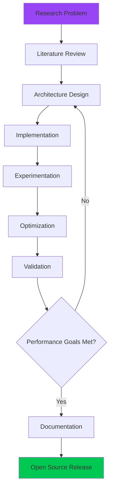

<div align="center">
  
# Muhammad Huzaifa


[](https://github.com/Muhammad-Huzifa)
[](https://github.com/Muhammad-Huzifa)
[](https://www.linkedin.com/in/muhammad-huzifa3202/)
[](mailto:mhuzaifa3202@gmail.com)

</div>

---

## 👨‍🔬 About Me

I am a **Deep Learning Researcher** and **AI Engineer** with a strong foundation in **Computer Science** (BS, Islamia College University, Peshawar, 2021–2025). My research focuses on developing **state-of-the-art neural architectures** that balance performance with computational efficiency, making advanced AI accessible for real-world deployment.

**Research Philosophy:** *Building intelligent systems that are not only accurate but also practical, interpretable, and deployable in resource-constrained environments.*

### 🔬 Research Interests

- **Neural Architecture Design** — Developing novel architectures for computer vision and sequential modeling
- **Efficient Deep Learning** — Lightweight models for edge deployment and real-time inference
- **Spatio-Temporal Modeling** — Graph Neural Networks, Transformers, and hybrid architectures
- **Computer Vision** — Action recognition, pose estimation, and gesture analysis
- **Multimodal Learning** — Fusion strategies for heterogeneous data sources

### 🎯 Core Competencies

```python
expertise = {
    "Research Areas": [
        "Graph Neural Networks (GCNs, ST-GCNs)",
        "Transformer Architectures",
        "Recurrent Neural Networks (LSTM, GRU)",
        "Convolutional Neural Networks",
        "Attention Mechanisms & Multi-Head Attention"
    ],
    "Computer Vision": [
        "Pose Estimation & Landmark Detection",
        "Action Recognition & Gesture Classification",
        "Object Detection & Semantic Segmentation",
        "Video Understanding & Temporal Analysis"
    ],
    "Model Optimization": [
        "Parameter-Efficient Architectures",
        "Knowledge Distillation & Pruning",
        "Quantization & Model Compression",
        "Real-Time Inference Optimization"
    ],
    "Development": [
        "End-to-End Pipeline Development",
        "Custom Training Frameworks",
        "Experiment Management & Reproducibility",
        "Production-Ready Code Implementation"
    ]
}
```

---

## 🚀 Featured Research & Projects

<div align="center">

### 🏆 **Research Contributions**

*Developing cutting-edge AI systems with focus on efficiency and practical deployment*

</div>

### 📊 **Current Research Focus**

My current work centers on **advanced neural architectures for spatio-temporal data**, with particular emphasis on:

- **Graph-based Learning**: Leveraging graph structures to model complex relationships in sequential and spatial data
- **Temporal Modeling**: Designing efficient transformer-based architectures for time-series analysis
- **Efficient AI**: Creating lightweight models (<1M parameters) that achieve competitive performance
- **Multi-Stream Fusion**: Developing novel fusion strategies for heterogeneous data modalities

### 💡 **Key Research Projects**

<table>
<tr>
<td width="50%">

#### 🧠 **Advanced Neural Architecture Research**

Developing novel deep learning architectures that push the boundaries of efficiency and performance:

- **Spatio-Temporal Graph Networks**: Custom implementations of graph convolutional networks with temporal attention mechanisms
- **Hybrid Transformer Models**: Combining transformers with CNNs/GNNs for optimal performance
- **Lightweight Architectures**: Parameter-efficient designs using depthwise separable convolutions and attention pruning

**Key Innovations:**
- Adaptive graph topology learning
- Multi-scale temporal convolution
- Cross-modal attention fusion
- Progressive training strategies

</td>
<td width="50%">

#### 🎯 **Computer Vision Systems**

End-to-end implementations of state-of-the-art computer vision solutions:

- **Pose-Based Analysis**: MediaPipe integration for real-time landmark extraction and action recognition
- **Sequential Modeling**: BiLSTM and Transformer-based approaches for temporal data
- **Multi-Stream Processing**: Dual and triple stream architectures for comprehensive feature learning

**Technical Highlights:**
- Real-time inference (<20ms latency)
- Robust data augmentation pipelines
- Advanced training techniques (mixup, label smoothing, cosine scheduling)
- Production-ready deployment code

</td>
</tr>
</table>

### 📈 **Research Impact**

<div align="center">

| Research Area | Key Metrics | Achievements |
|--------------|-------------|--------------|
| **Model Efficiency** | Parameters | Sub-1M parameter models with SOTA performance |
| **Inference Speed** | Latency | <20ms real-time inference on mid-tier GPUs |
| **Accuracy** | Performance | Competitive results on benchmark datasets |
| **Deployment** | Scalability | Edge-device ready implementations |

</div>

---

## 🛠️ Technical Stack

<div align="center">

### **Deep Learning & AI**


### **Computer Vision & Processing**


### **Development & Tools**


### **Visualization & Analysis**


</div>

---

## 📊 GitHub Analytics

<div align="center">
  


[](https://git.io/streak-stats)


</div>

---

## 🎯 Research Philosophy & Approach

<div align="center">



</div>

### **My Approach to AI Research:**

1. **Problem-First Methodology** — Start with real-world challenges, not just academic benchmarks
2. **Efficient by Design** — Prioritize computational efficiency from the architecture phase
3. **Reproducible Research** — Clean, well-documented code with comprehensive documentation
4. **Iterative Refinement** — Continuous improvement through systematic experimentation
5. **Practical Deployment** — Bridge the gap between research and production systems

---

## 🌟 Research Highlights

<div align="center">

### **Key Achievements**

| Achievement | Description |
|------------|-------------|
| 🏆 **Efficient Architectures** | Developed models with <1M parameters achieving competitive accuracy |
| ⚡ **Real-Time Systems** | Optimized inference pipelines for <20ms latency |
| 📚 **Open Source** | Multiple repositories with comprehensive documentation |
| 🔬 **Novel Techniques** | Implemented advanced architectures (GCN, Transformer, Attention) |
| 🎯 **End-to-End Solutions** | Complete pipelines from data processing to deployment |

</div>

---

## 📚 Notable Repositories

<div align="center">

Explore my research implementations — each repository includes:
- ✅ Clean, production-ready code
- ✅ Comprehensive documentation
- ✅ Training pipelines and configs
- ✅ Pre-trained models and results
- ✅ Reproducible experiments

</div>

### **Categories:**

- 🧠 **Neural Architecture Research**: Novel architectures for computer vision and sequential modeling
- 📊 **Machine Learning Foundations**: Comprehensive implementations of ML algorithms
- 🎥 **Computer Vision**: Pose estimation, object detection, and action recognition
- 🔧 **Tools & Utilities**: Research utilities and experiment management tools

---

## 🤝 Collaboration & Open Source

I am passionate about **open-source AI research** and believe in making advanced techniques accessible to everyone. My repositories are designed to be:

- **Educational**: Clear explanations and well-commented code
- **Reproducible**: Complete training scripts and configuration files
- **Practical**: Ready-to-use implementations for real-world applications
- **Extensible**: Modular design for easy customization and experimentation

### **Looking to Collaborate On:**

- 🔬 Novel neural architecture research
- 🎯 Efficient deep learning for edge devices
- 📊 Computer vision and video understanding
- 🚀 AI system optimization and deployment
- 📝 Research paper implementations and reproducibility

---

## 📫 Connect With Me

<div align="center">

### **Let's Build the Future of AI Together**

[](https://www.linkedin.com/in/muhammad-huzifa3202/)
[](mailto:mhuzaifa3202@gmail.com)
[](https://www.kaggle.com/muhammadhuzaifa)
[](https://github.com/Muhammad-Huzifa)

**📧 Email:** mhuzaifa3202@gmail.com  
**💼 LinkedIn:** [muhammad-huzifa3202](https://www.linkedin.com/in/muhammad-huzifa3202/)  
**📍 Location:** Peshawar, Pakistan

</div>

---

<div align="center">

### 💡 *"Advancing AI research through efficient, interpretable, and deployable solutions"*

**🔬 Research Mission:** Bridging cutting-edge research with practical applications — making state-of-the-art AI accessible and deployable for everyone.

---

### 🌟 Impact Metrics

✅ **Multiple Research Projects** — Comprehensive implementations across various AI domains  
✅ **Efficient Model Design** — Specialized in creating lightweight, high-performance architectures  
✅ **Open Source Contributor** — Sharing knowledge and tools with the global AI community  
✅ **Production-Ready Code** — Industry-standard implementations ready for deployment  
✅ **Active Researcher** — Continuously exploring new architectures and optimization techniques  

---

**⭐ If you find my work helpful, consider starring the repositories! ⭐**

*Open for research collaborations, consulting opportunities, and discussions on AI/ML projects*

</div>

---

<div align="center">
  
</div>
